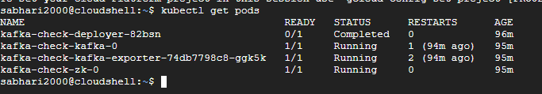
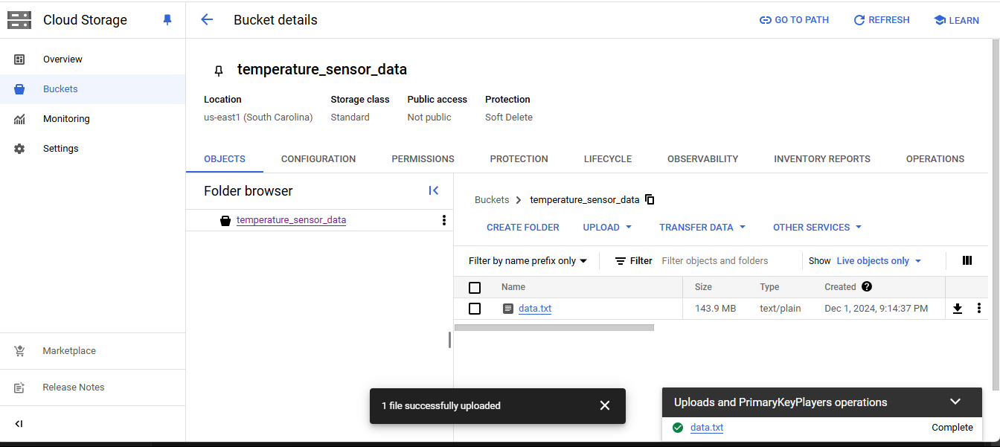
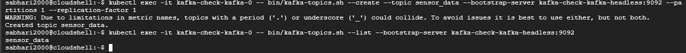
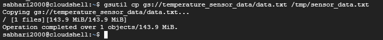
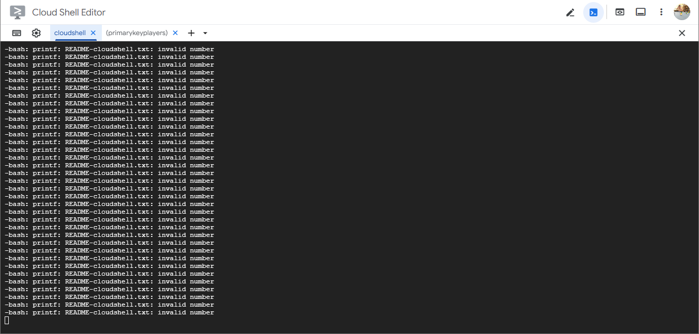
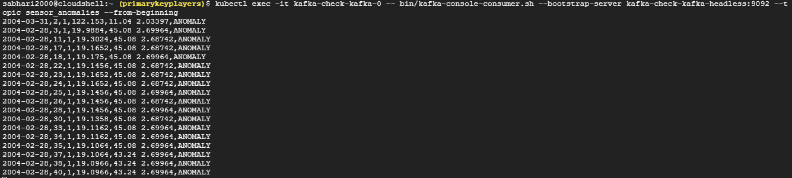

# Real-time-IoT-Sensor-Anomaly-Detection-using-Kafka-Streams-on-GKE-A-Cloud-Native-Implementation
A high-performance, cloud-native solution for real-time anomaly detection in IoT sensor networks using Apache Kafka on GKE. This project demonstrates advanced streaming data processing by implementing two distinct approaches: a traditional line-by-line method and an optimized KSQL stream processing solution,achieving a 25x performance improvement. 

Key Features:
1. Cloud-native deployment on GKE with Kafka clusters
2.  Real-time anomaly detection for temperature, humidity, and voltage readings
3. Scalable data pipeline processing 2.3M+ records
4. Performance optimization from 6.3 hours to 10-15 minutes processing time
5. Implementation of both traditional and KSQL stream processing approaches (Dual implementation approach)

Anomaly Detection Parameters:
1. Temperature: > 100° or < 0°
2. Humidity: < 0% or > 100%
3. Voltage: < 1.5V or > 3.0V

Performance Metrics
1. Line-by-line processing: 6.3 hours for 2.3M records
2.  KSQL stream processing: 10-15 minutes for 2.3M records
3.  Per record processing time: ~8-14ms (line-by-line)

Technologies: Kubernetes, Apache Kafka, KSQL, Google Cloud Platform, Shell Scripting

The implementation began with deploying Apache Kafka in Google Cloud Platform's Kubernetes Engine using the available marketplace image. I configured the deployment with essential parameters including namespace configuration (default), storage class (premium-rwo), and resource allocations for both Kafka (10Gi) and ZooKeeper (5Gi) instances. The deployment resulted in a fully functional Kafka cluster consisting of kafka-check-kafka-0 pod for the broker, kafka-check-kafka-exporter for metrics collection, and kafka-check-zk-0 for ZooKeeper coordination.

Following the cluster setup, I established a data pipeline for processing sensor readings. The pipeline began with uploading our dataset containing 2.3 million temperature, humidity, light, and voltage readings to a GCP bucket. I then implemented a streaming mechanism using kubectl commands to transfer data from the GCS bucket to our Kafka cluster. The data ingestion process utilized Kafka's console producer with the command kubectl exec, streaming data through the kafka-check-kafka-headless:9092 broker to a dedicated topic named 'sensor_data'.

As I spin up the GKE, first check its status,

I then Upload our source data to GCP buckets

Now I create a new topic and check whether the topic is created succesfully

Now I set up the data pipeline from GCP buckets to kubernetes pods

Then I proceed as given in the final txt.txt file and observed the realtime anamoly detection in two different terminals.

Data pipeline implementation showing the real-time streaming of sensor data through Kafka topics. The output demonstrates successful data ingestion and processing through the Kafka broker, with each line representing a sensor reading containing timestamp, epoch, moteid, temperature, humidity, light, and voltage values.

Real-time anomaly detection results showing identified anomalies in the sensor data. Each line represents an anomaly detected with its corresponding timestamp, moteid, temperature, humidity, and voltage values, followed by the 'ANOMALY' flag, demonstrating the effectiveness of our threshold-based detection system.

Result:

The performance analysis revealed significant differences between the two approaches. The line-by-line processing exhibited considerable computational overhead, requiring approximately 8-14ms per record and resulting in a total processing duration of 6.3 hours for the complete dataset. In contrast, the stream processing implementation demonstrated remarkable efficiency, completing the entire analysis in 10-15 minutes while maintaining the same detection accuracy. This improvement was achieved through parallel processing capabilities and optimized memory usage, making it particularly suitable for real-time IoT monitoring applications. The implementation on Google Cloud Platform's Kubernetes Engine provided automated resource management and horizontal scalability, enabling efficient processing of large-scale sensor data streams.
